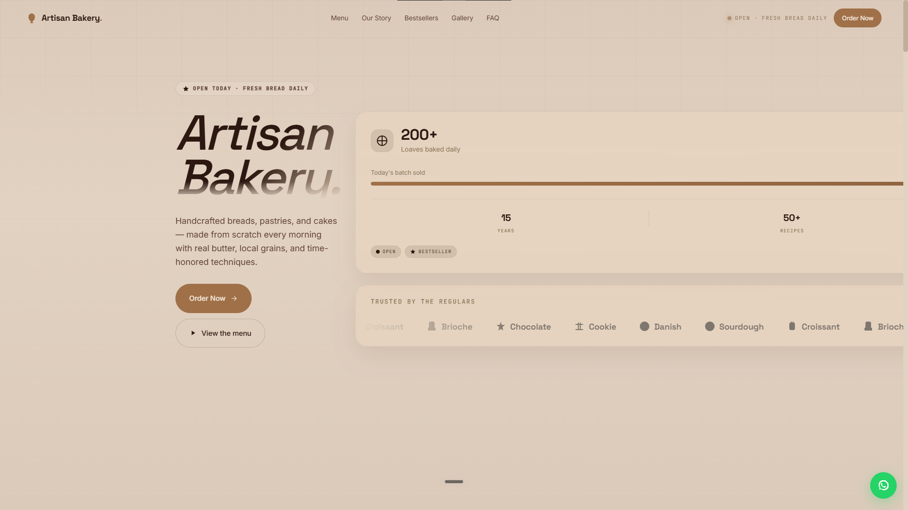
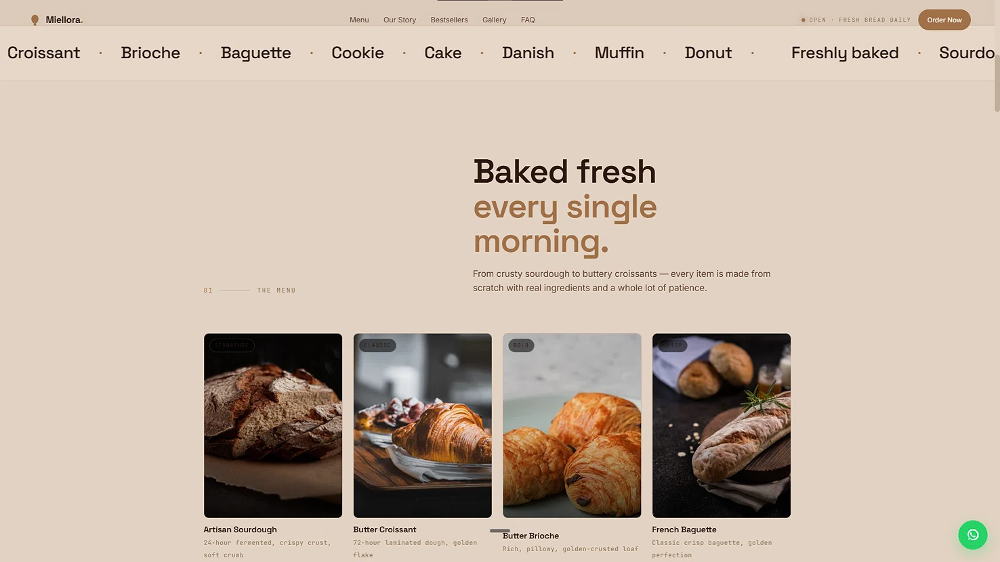
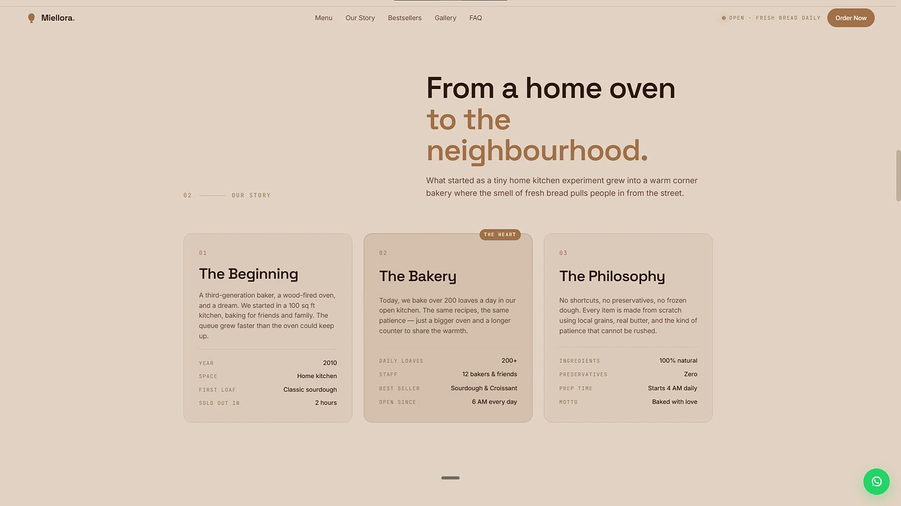
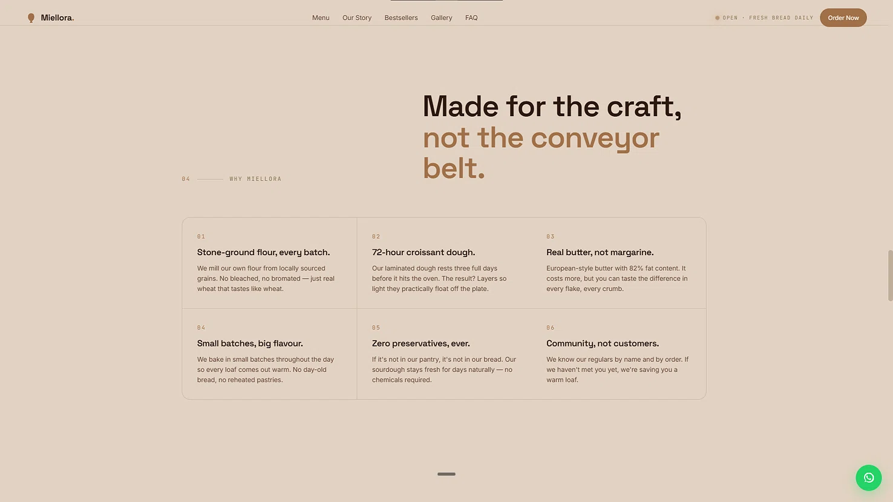
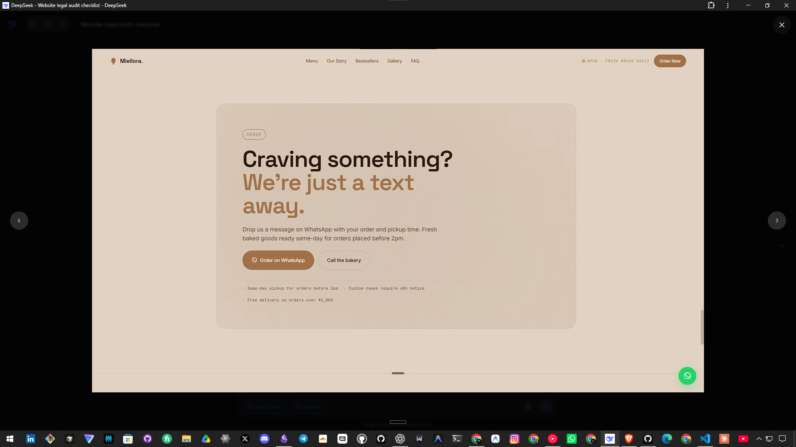

# Miellora — Artisan Bakery

A landing page concept for a warm, handcrafted-feeling artisan bakery in Connaught Place, New Delhi.

🔗 **Live:** https://miellora.akshaycodecrafter.workers.dev/

## Preview










)

## About

Miellora came from wanting a bakery site that felt handmade rather than corporate — most bakery landing pages either go overly cute or overly minimal, and I wanted something in between: warm tones, real texture, and enough detail (a founding year, a story section, a stats card) to feel like an actual neighborhood spot rather than a template. The whole page is built around the idea of a small team baking fresh, single-batch bread and pastries every morning.

## What's on the page

- **Hero** — the bakery's stats card (loaves baked daily, years in business, today's batch progress) alongside the WhatsApp/call order flow
- **Kitchen marquee** — a scrolling strip of signature bakes (Sourdough, Croissant, Brioche, etc.)
- **Menu** — bread, pastry, and cake listings with photography
- **Story** — a founding-year narrative section (est. 2010)
- **Bestsellers** — highlighted top-selling items
- **Gallery** — shots of the bakery and products
- **FAQ** — accordion-style common questions
- **Order** — WhatsApp and phone-based ordering (no backend form, direct-contact links only)

## Built with


- Vanilla HTML/CSS/JS — no frameworks, no build step
- Scroll-reveal animations, smooth-scroll navigation, and JSON-LD structured data for local business SEO
- Fully responsive

## Why I built it this way

Same reasoning as my other landing-page concepts: for a single page like this, a build pipeline just adds friction. Keeping it plain HTML/CSS/JS means the whole project is readable end-to-end in a few minutes, with the trade-off being one longer CSS file instead of reusable components — a fair trade for a project this size.

## Running it locally

```
maison-miel/
├── index.html
├── css/
│   └── style.css
├── js/
│   └── script.js
└── assets/
```

Just clone the repo and open `index.html` in a browser — no build step, no dependencies.

## Status

Demo/concept build. Contact details, pricing, and order flow are illustrative only.
